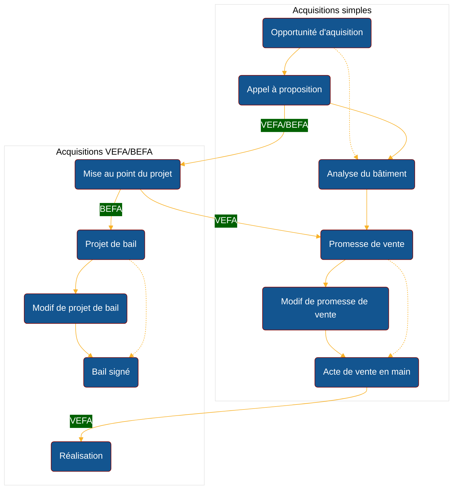
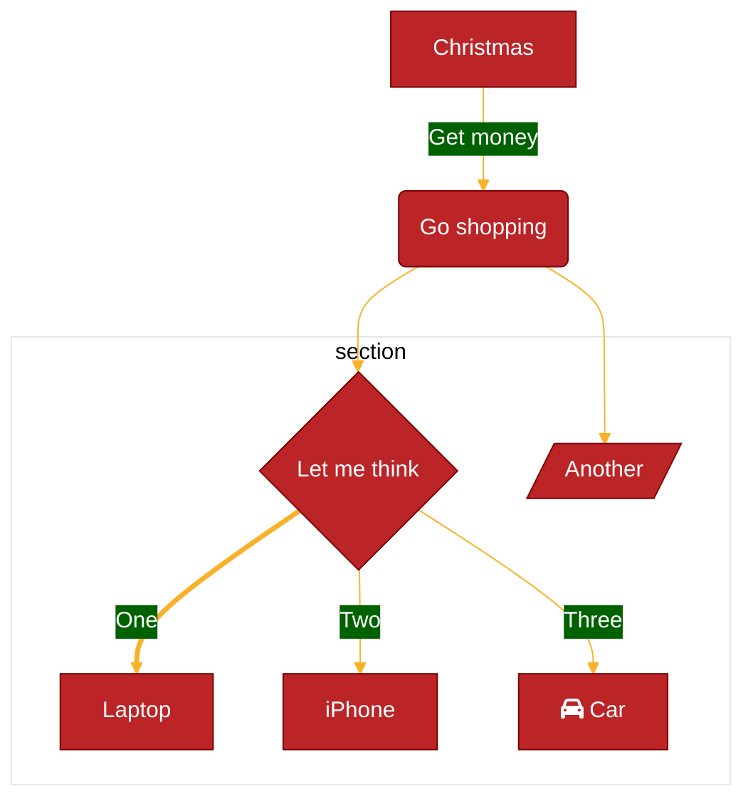

# La syntaxe markdown

Site [ici](https://docs.framasoft.org/fr/grav/markdown.html)

[markdown pour gitlab](https://docs.gitlab.com/ee/user/markdown.html)

### Des graphiques avec mermaid.js

[mermaid.js](https://mermaid.js.org/intro/)

Available Themes
default - This is the default theme for all diagrams.

neutral - This theme is great for black and white documents that will be printed.

dark - This theme goes well with dark-colored elements or dark-mode.

forest - This theme contains shades of green.

base - This is the only theme that can be modified. Use this theme as the base for customizations.


Exemple :

        ```mermaid
        graph TD;
            A-->B;
            A-->C;
            B-->D;
            C-->D;
        ```

Retourne :


### Parcours d'un workflow

    ```mermaid
    %%{
        init: {
           'theme': 'base',
           'themeVariables': {
           'primaryColor': '#BB2528',
               'primaryTextColor': '#fff',
               'primaryBorderColor': '#7C0000',
               'lineColor': '#F8B229',
               'secondaryColor': '#006100',
               'tertiaryColor': '#fff'
           }
        }
    }%%

    graph TB
        subgraph "Acquisitions simples"
        O1("Opportunité d'aquisition") --> A1("Appel à proposition")
        O1  -.-> A2("Analyse du bâtiment")
        A1 --> A2
        A2 --> P1("Promesse de vente")
        P1 --> M1("Modif de promesse de vente")
        M1 --> A3("Acte de vente en main")
        P1 -.-> A3
        end

        subgraph "Acquisitions VEFA/BEFA"
        A1 -- VEFA/BEFA --> M2("Mise au point du projet")
        M2 -- VEFA --> P1
        M2 -- BEFA --> P2("Projet de bail")
        P2 --> M3("Modif de projet de bail")
        M3 --> B1("Bail signé")
        P2 -.-> B1
        A3 -- VEFA --> R1("Réalisation")
        end
    ```





### Mettre en surbrillance les commandes bash/shell dans le démarquage

[blocks pour langage](https://arcticicestudio.github.io/styleguide-markdown/rules/code.html)

Quelques exemples de coque :

Shell:      console, shell, shellscript

Bash:       bash, sh, zsh

PowerShell: powershell, ps

DOS:        dos, bat, cmd

Exemple:

    ```bat
    cd \
    copy a b
    ping 192.168.0.1
    ```

Si j'ai seulement besoin de surligner le premier mot en tant que commande, j'utilise souvent properties:

    ```properties
    npm run build
    ```  

#### Liste

Cucumber ('*.feature')

abap ('*.abap')

ada ('.adb', '.ads', '*.ada')

ahk ('.ahk', '.ahkl')

apacheconf ('.htaccess', 'apache.conf', 'apache2.conf')

applescript ('*.applescript')

as ('*.as')

as3 ('*.as')

asy ('*.asy')

bash ('.sh', '.ksh', '.bash', '.ebuild', '*.eclass')

bat ('.bat', '.cmd')

befunge ('*.befunge')

blitzmax ('*.bmx')

boo ('*.boo')

brainfuck ('.bf', '.b')

c ('.c', '.h')

cfm ('.cfm', '.cfml', '*.cfc')

cheetah ('.tmpl', '.spt')

cl ('.cl', '.lisp', '*.el')

clojure ('.clj', '.cljs')

cmake ('*.cmake', 'CMakeLists.txt')

coffeescript ('*.coffee')

console ('*.sh-session')

control ('control')

cpp ('.cpp', '.hpp', '.c++', '.h++', '.cc', '.hh', '.cxx', '.hxx', '*.pde')

csharp ('*.cs')

css ('*.css')

cython ('.pyx', '.pxd', '*.pxi')

d ('.d', '.di')

delphi ('*.pas')

diff ('.diff', '.patch')

dpatch ('.dpatch', '.darcspatch')

duel ('.duel', '.jbst')

dylan ('.dylan', '.dyl')

erb ('*.erb')

erl ('*.erl-sh')

erlang ('.erl', '.hrl')

evoque ('*.evoque')

factor ('*.factor')

felix ('.flx', '.flxh')

fortran ('.f', '.f90')

gas ('.s', '.S')

genshi ('*.kid')

glsl ('.vert', '.frag', '*.geo')

gnuplot ('.plot', '.plt')

go ('*.go')

groff ('.(1234567)', '.man')

haml ('*.haml')

haskell ('*.hs')

html ('.html', '.htm', '.xhtml', '.xslt')

hx ('*.hx')

hybris ('.hy', '.hyb')

ini ('.ini', '.cfg')

io ('*.io')

ioke ('*.ik')

irc ('*.weechatlog')

jade ('*.jade')

java ('*.java')

js ('*.js')

jsp ('*.jsp')

lhs ('*.lhs')

llvm ('*.ll')

logtalk ('*.lgt')

lua ('.lua', '.wlua')

make ('.mak', 'Makefile', 'makefile', 'Makefile.', 'GNUmakefile')

mako ('*.mao')

maql ('*.maql')

mason ('.mhtml', '.mc', '*.mi', 'autohandler', 'dhandler')

markdown ('*.md')

modelica ('*.mo')

modula2 ('.def', '.mod')

moocode ('*.moo')

mupad ('*.mu')

mxml ('*.mxml')

myghty ('*.myt', 'autodelegate')

nasm ('.asm', '.ASM')

newspeak ('*.ns2')

objdump ('*.objdump')

objectivec ('*.m')

objectivej ('*.j')

ocaml ('.ml', '.mli', '.mll', '.mly')

ooc ('*.ooc')

perl ('.pl', '.pm')

php ('.php', '.php(345)')

postscript ('.ps', '.eps')

pot ('.pot', '.po')

pov ('.pov', '.inc')

prolog ('.prolog', '.pro', '*.pl')

properties ('*.properties')

protobuf ('*.proto')

py3tb ('*.py3tb')

pytb ('*.pytb')

python ('.py', '.pyw', '.sc', 'SConstruct', 'SConscript', '.tac')

r ('*.R')

rb ('.rb', '.rbw', 'Rakefile', '.rake', '.gemspec', '.rbx', '.duby')

rconsole ('*.Rout')

rebol ('.r', '.r3')

redcode ('*.cw')

rhtml ('*.rhtml')

rst ('.rst', '.rest')

sass ('*.sass')

scala ('*.scala')

scaml ('*.scaml')

scheme ('*.scm')

scss ('*.scss')

smalltalk ('*.st')

smarty ('*.tpl')

sourceslist ('sources.list')

splus ('.S', '.R')

sql ('*.sql')

sqlite3 ('*.sqlite3-console')

squidconf ('squid.conf')

ssp ('*.ssp')

tcl ('*.tcl')

tcsh ('.tcsh', '.csh')

tex ('.tex', '.aux', '*.toc')

text ('*.txt')

v ('.v', '.sv')

vala ('.vala', '.vapi')

vbnet ('.vb', '.bas')

velocity ('.vm', '.fhtml')

vim ('*.vim', '.vimrc')

xml ('.xml', '.xsl', '.rss', '.xslt', '.xsd', '.wsdl')

xquery ('.xqy', '.xquery')

xslt ('.xsl', '.xslt')

yaml ('.yaml', '.yml')

Output


### Extensions Markdown prises en charge par Open Publishing

Le Learn Authoring Pack contient des outils qui prennent en charge des fonctionnalités uniques à notre système de publication. Les alertes sont une extension Markdown permettant de créer des blockquotes qui s'affichent avec des couleurs et des icônes soulignant l'importance du contenu. Les types d'alertes suivants sont pris en charge :

```ps
> [!NOTE]
> Information the user should notice even if skimming.

> [!TIP]
> Optional information to help a user be more successful.

> [!IMPORTANT]
> Essential information required for user success.

> [!CAUTION]
> Negative potential consequences of an action.

> [!WARNING]
> Dangerous certain consequences of an action.
```

Bloc-notes
> [!NOTE]
> Information the user should notice even if skimming.

Bloc de pourboires
> [!TIP]
> Optional information to help a user be more successful.

Bloc important
> [!IMPORTANT]
> Essential information required for user success.

Blocage de précaution
> [!CAUTION]
> Negative potential consequences of an action.

Bloc d'avertissement
> [!WARNING]
> Dangerous certain consequences of an action.

### Accent

Vous pouvez mettre en valeur le texte de plusieurs manières. Utilisez l'italique, le gras, le barré ou combinez ces styles d'accentuation ensemble.

```
Emphasis, or italics, with *asterisks* or _underscores_.

Strong emphasis, or bold, with double **asterisks** or __underscores__.

Combined emphasis with **asterisks and _underscores_**.

Strikethrough with double tildes. ~~Scratch this.~~
```


Emphasis, or italics, with *asterisks* or _underscores_.

Strong emphasis, or bold, with double **asterisks** or __underscores__.

Combined emphasis with **asterisks and _underscores_**.

Strikethrough with double tildes. ~~Scratch this.~~


### Rubrique

Créez des titres de 1 à 6 en utilisant #.

```
# H1
## H2
### H3
#### H4
##### H5
###### H6
```

# H1
## H2
### H3
#### H4
##### H5
###### H6

Alternativement, pour H1 et H2, utilisez un style souligné :

```
Alt-H1
======

Alt-H2
------
```

Alt-H1
======

Alt-H2
------

### La règle horizontale

Créez une règle horizontale en utilisant au moins trois traits d'union, astérisques ou traits de soulignement :
```
---

***

___
```

---

***

___


### Modifier les dimensions de l'image ou de la vidéo

```
{width=100 height=100px}

{width=75%}
```

### HTML en ligne

```
<dl>
  <dt>Definition list</dt>
  <dd>Is something people use sometimes.</dd>

  <dt>Markdown in HTML</dt>
  <dd>Does *not* work **very** well. HTML <em>tags</em> do <b>work</b>, in most cases.</dd>
</dl>
```

<dl>
  <dt>Definition list</dt>
  <dd>Is something people use sometimes.</dd>

  <dt>Markdown in HTML</dt>
  <dd>Does *not* work **very** well. HTML <em>tags</em> do <b>work</b>, in most cases.</dd>
</dl>

### Section pliable

Le contenu peut être réduit à l'aide de HTML `<details>` et `<summary>` de balises. Par exemple, réduisez un long fichier journal pour qu’il occupe moins d’espace à l’écran.
```
<details>
<summary>Click to expand</summary>

These details <em>remain</em> <strong>hidden</strong> until expanded.

<pre><code>PASTE LOGS HERE</code></pre>

</details>
```

<details>
<summary>Click to expand</summary>

These details <em>remain</em> <strong>hidden</strong> until expanded.

<pre><code>PASTE LOGS HERE</code></pre>

</details>


Le Markdown à l’intérieur de ces balises est également pris en charge.

N'oubliez pas de laisser une ligne vide avant et après toute section Markdown, comme le montre l'exemple :

```
    <details>
    <summary>

    Click to _expand._

    </summary>

    These details _remain_ **hidden** until expanded.

    ```
    PASTE LOGS HERE
    ```
    </details>
```

<details>
<summary>

Click to _expand._

</summary>

These details _remain_ **hidden** until expanded.

```
PASTE LOGS HERE
```

</details>

### Exposants / Indices

Pour les exposants et les indices, utilisez la syntaxe HTML standard :

```
The formula for water is H<sub>2</sub>O
while the equation for the theory of relativity is E = mc<sup>2</sup>.
```

The formula for water is H<sub>2</sub>O
while the equation for the theory of relativity is E = mc<sup>2</sup>.

### Balise HTML du clavier

L' `<kbd>`élément est utilisé pour identifier le texte qui représente la saisie au clavier de l'utilisateur. Le texte entouré de `<kbd>`balises est généralement affiché dans la police monospace par défaut du navigateur.

```
Press <kbd>Enter</kbd> to go to the next page.
```

Press <kbd>Enter</kbd> to go to the next page.

### Les Tables

```
| header 1 | header 2 | header 3 |
| ---      | ---      | ---      |
| cell 1   | cell 2   | cell 3   |
| cell 4 | cell 5 is longer | cell 6 is much longer than the others, but that's ok. It eventually wraps the text when the cell is too large for the display size. |
| cell 7   |          | cell 9   |
```

| header 1 | header 2 | header 3 |
| ---      | ---      | ---      |
| cell 1   | cell 2   | cell 3   |
| cell 4 | cell 5 is longer | cell 6 is much longer than the others, but that's ok. It eventually wraps the text when the cell is too large for the display size. |
| cell 7   |          | cell 9   |

#### Alignement

De plus, vous pouvez choisir l'alignement du texte dans les colonnes en ajoutant des deux-points ( :) sur les côtés des lignes « tirets » de la deuxième ligne. Cela affecte chaque cellule de la colonne :

```
| Left Aligned | Centered | Right Aligned |
| :---         | :---:    | ---:          |
| Cell 1       | Cell 2   | Cell 3        |
| Cell 4       | Cell 5   | Cell 6        |
```

| Left Aligned | Centered | Right Aligned |
| :---         | :---:    | ---:          |
| Cell 1       | Cell 2   | Cell 3        |
| Cell 4       | Cell 5   | Cell 6        |

#### Cellules avec plusieurs lignes

Vous pouvez utiliser le formatage HTML pour ajuster le rendu des tableaux. Par exemple, vous pouvez utiliser <br>des balises pour forcer une cellule à comporter plusieurs lignes :

```
| Name | Details |
| ---  | ---     |
| Item1 | This text is on one line |
| Item2 | This item has:<br>- Multiple items<br>- That we want listed separately |
```

| Name | Details |
| ---  | ---     |
| Item1 | This text is on one line |
| Item2 | This item has:<br>- Multiple items<br>- That we want listed separately |

#### Listes de tâches dans les tableaux

Un tableau Markdown avec des balises de liste HTML. Ces tâches ne sauvegardent pas leur état lorsqu'elles sont sélectionnées. Les tableaux formatés de cette façon ne s'affichent pas correctement sur docs.gitlab.com.


```
| header 1 | header 2 |
| ---      | ---      |
| cell 1   | cell 2   |
| cell 3   | <ul><li> - [ ] Task one </li><li> - [ ] Task two </li></ul> |
```

| header 1 | header 2 |
| ---      | ---      |
| cell 1   | cell 2   |
| cell 3   | <ul><li> - [ ] Task one </li><li> - [ ] Task two </li></ul> |

